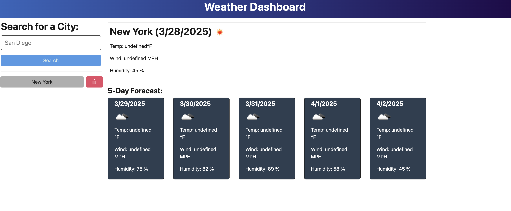

# Weather App

  ## License
  
  [Creative Commons licenses (for documentation)](http://creativecommons.org/publicdomain/zero/1.0/)

  ## Contents
  ---------
  - [License](#license)
  - [Description](#description)
  - [Installation](#installation)
  - [Usage](#usage)
  - [Contribution](#contribution)
  - [Questions](#questions)

  ## Description
  This program allows you to check the weather in a user provided city as well as keep a continually updated search history based on user input.

  ## Installation
  Because this a web specific program that uses an API from Open Weather (https://openweathermap.org/forecast5) you will be able to clone the repo:

  `` git clone git@github.com:bjaegerthomas/Weather-app.git ``

  But you will need to use a program like Render (https://render.com/) to deploy and use it or to see it's functionality.

  You also can simply visit my deployed version (https://weather-app-xzuf.onrender.com) and follow the usage instructions below.

  Here is a screenshot of the deployed application:

  

  ## Usage
  Simply enter a city into the search bar at the far left of your screen. Hit Enter or click on the Search button and you will get a 5 day forecast and current weather for that city.

  ## Contribution
  After cloning the repository be sure to create a new branch for your feature or fix.
  Make your changes and commit them with descriptive messages.
  Submit a Pull Request with clear explanations of your modifications.
  Use meaningful variable names and comments.
  Follow guidelines for Javascript and Typescript code formatting.

  ## Questions
  - GitHub: [bjaegerthomas](https://github.com/bjaegerthomas)
  - Email: bjaegerthomas@gmail.com